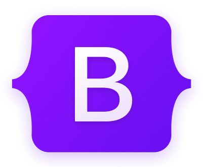
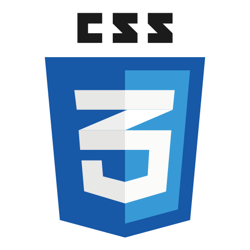

# Hola! Me llamo Agustin 👋
### Estudiante argentino de Desarrollo de Software

- Actualmente estoy trabajando en mi primer **e-commerce** [EKOS](https://aguscuuuu.github.io/coder-ekos/)

- Soy un estudiante de la **Licenciatura en Sistemas** en la **Universidad Nacional de Lanús**

- Me encuentro realizando un curso de **Full Stack Web Development**

- Todos mis proyectos se encuentran en mi [github](https://github.com/aguscuuuu)

- Mi mail de contacto es **agustin.cuenca.ct@gmail.com**

## Encontrame en 

   
     
     

## Lenguajes y herramientas

 
    
    
    
     
     
    

