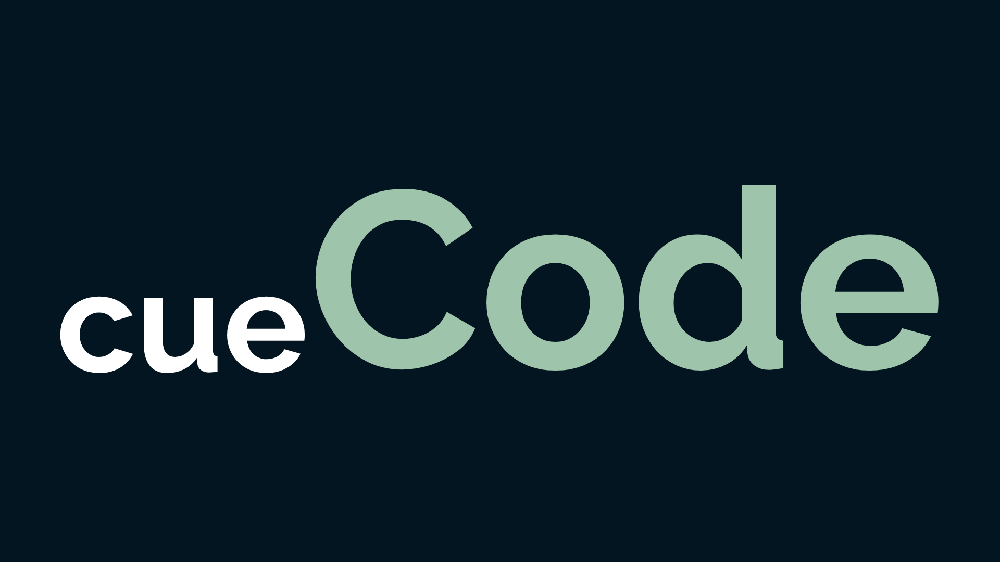

# Hola! Me llamo Agustin 

### Estudiante argentino de Desarrollo de Software

- Actualmente estoy trabajando en mi primer Frontend de **E-Commerce** [EKOS Accesorios](https://aguscuuuu.github.io/coder-ekos/)

- Soy un estudiante de la **Licenciatura en Sistemas** en la **Universidad Nacional de Lanús**

- Me estoy excursionando en el Backend
  
- Próximo a aprender Data Science

- Todos mis proyectos se encuentran en este perfil de Github

- Mi mail de contacto es **agustin.cuenca.ct@gmail.com**

## Encontrame en 

   
     
     

## Mis habilidades

 
    
    
    
    
    
     
    
    

